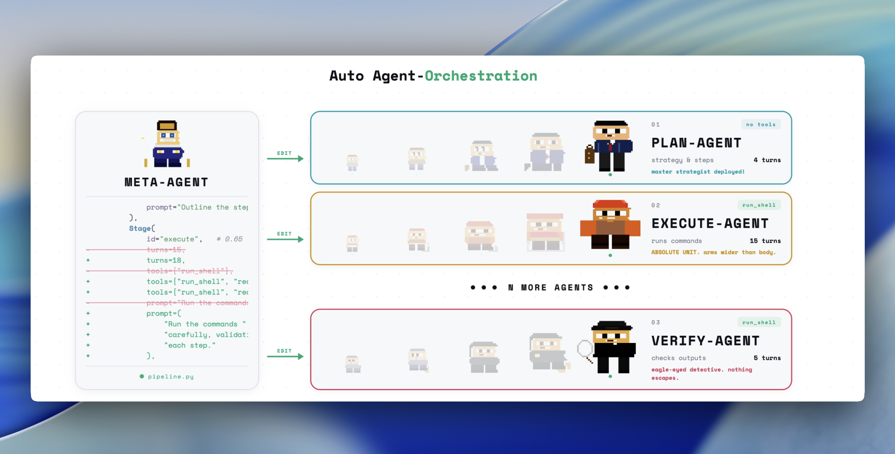
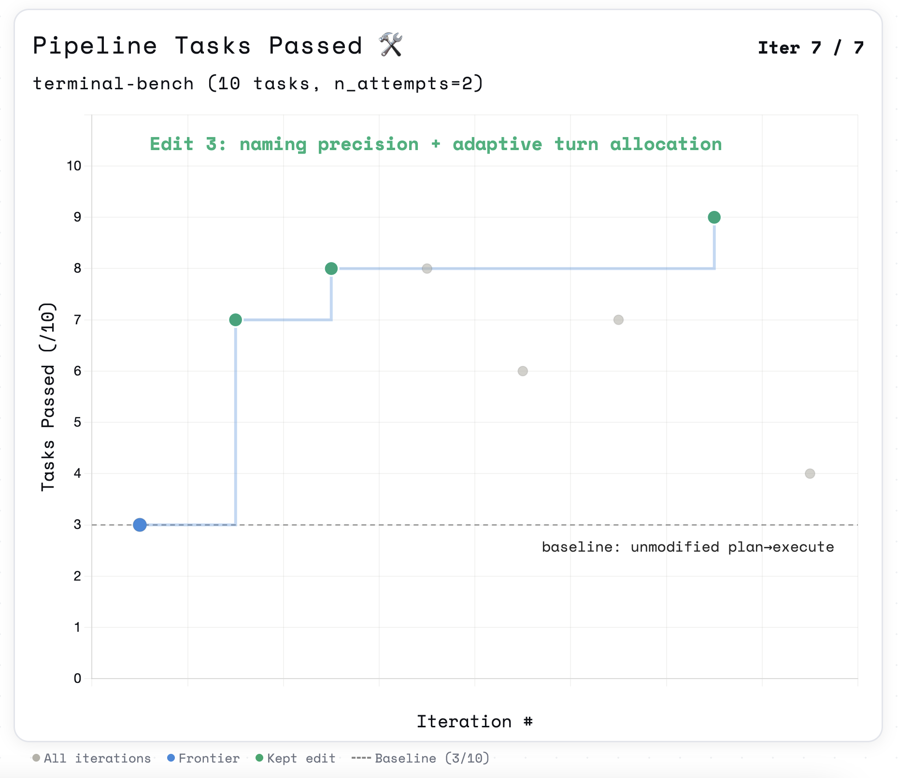

# AutoSwarm

[](https://opensource.org/licenses/MIT)
[](https://github.com/YOUR_USERNAME/YOUR_REPO)
[](https://github.com/YOUR_USERNAME/YOUR_REPO)
[](https://www.python.org/)
[](https://docs.astral.sh/uv/)
[](https://docker.com)



> A multi-agent pipeline harness that self-optimizes its own topology. A meta-agent edits stage prompts, tool assignments, turn budgets, and pipeline structure — then reruns the benchmark, checks the score, keeps or discards the change, and repeats.

## How it works

- **`pipeline_spec.yaml`** — the topology the meta-agent edits. Defines stages (system prompt, tools, turn budget, output format) and handoffs (token budget, context format) between them. This is the primary edit surface.
- **`pipeline.py`** — the runner. Reads `pipeline_spec.yaml` and executes the pipeline. Contains a small editable section (tool definitions, compression logic) and a fixed Harbor adapter boundary.
- **`evaluator.py`** — per-stage LLM judge. After each run, scores every stage on how well its output equipped the next stage. Produces `stage_scores` for `results.tsv` so the meta-agent can identify exactly which stage is failing.
- **`program_pipeline.md`** — meta-agent instructions. Defines the experiment loop, triage, credit assignment, structural edit rules, and keep/discard criteria.
- **`agent.py`** — single-agent baseline harness for comparison runs.
- **`tasks/`** — evaluation tasks in [Harbor](https://github.com/laude-institute/harbor) format.

The metric is total **passed** tasks. The meta-agent hill-climbs on this score by editing the pipeline topology.



## Quick start

**Requirements:** Docker, Python 3.12+, [uv](https://docs.astral.sh/uv/), `OPENAI_API_KEY`.

```bash
# 1. Install uv (if you don't have it)
curl -LsSf https://astral.sh/uv/install.sh | sh

# 2. Install dependencies
uv sync

# 3. Set credentials
cat > .env << 'EOF'
OPENAI_API_KEY=...
EOF

# 4. Add tasks to tasks/ (see Task format below), or use a registry dataset (see below)

# 5. Run the pipeline harness on local tasks (swap pipeline:AutoAgent for
#    agent:AutoAgent to run the single-agent baseline for comparison).
rm -rf jobs && uv run harbor run -p tasks/ -n 89 \
  --agent-import-path pipeline:AutoAgent \
  --n-concurrent 12 \
  -o jobs --job-name latest > run.log 2>&1
```

**Registry dataset (no local task checkout required):** the harness loads from your repo via `uv`; Docker runs **task** environments only. For example:

```bash
uv run harbor run \
  --dataset terminal-bench@2.0 \
  --agent-import-path pipeline:AutoAgent \
  --n-concurrent 12 \
  --n-tasks 89 \
  --env-file .env \
  -o jobs --job-name latest > run.log 2>&1
```

## Running the meta-agent

Point your coding agent at the repo and prompt:

```
Read program_pipeline.md and let's kick off a new experiment!
```

The meta-agent will read the directive, inspect `pipeline_spec.yaml`, run the benchmark, score each stage with `evaluator.py`, edit the topology, and iterate.

## Project structure

```text
pipeline_spec.yaml             -- pipeline topology (primary edit surface)
pipeline.py                    -- pipeline runner + Harbor adapter
  editable section             -- load_spec, tools, compress_handoff, run_task
  fixed adapter section        -- PipelineResult, to_atif, AutoAgent
evaluator.py                   -- per-stage LLM judge
program_pipeline.md            -- meta-agent instructions for pipeline optimization
agent.py                       -- single-agent baseline harness
Dockerfile.base                -- optional base image for custom task Dockerfiles (`FROM autoswarm-base`)
tasks/                         -- benchmark tasks
jobs/                          -- Harbor job outputs (gitignored)
results.tsv                    -- experiment log (gitignored)
run.log                        -- latest run output (gitignored)
```

## pipeline_spec.yaml

This is what the meta-agent reads and edits. Stage-level fields:

| Field           | Description                                                                                                           |
| --------------- | --------------------------------------------------------------------------------------------------------------------- |
| `system_prompt` | Instructions for this stage's agent                                                                                   |
| `tools`         | Tool list — any subset of `run_shell`, `read_file`, `write_file` (register more in `pipeline.py`'s `_TOOL_FACTORIES`) |
| `max_turns`     | Turn budget for this stage                                                                                            |
| `output_format` | Hint to the agent: `bullet_list` \| `json` \| `prose` \| `structured_json`                                            |
| `model`         | Model override (inherits `pipeline.model` if omitted)                                                                 |

Handoff fields between stages:

| Field                | Description                                    |
| -------------------- | ---------------------------------------------- |
| `token_budget`       | Max tokens of context passed to the next stage |
| `format`             | Format hint for context compression            |
| `include_raw_output` | If true, passes full output uncompressed       |

## Stage evaluator

After a run, score stage traces:

```bash
RUN_DIR=$(ls -td jobs/*/ | head -1)
for task_dir in "${RUN_DIR}"/*/; do
  traces="$task_dir/logs/stage_traces.json"
  instr="$(cat tasks/$(basename "$task_dir")/instruction.md 2>/dev/null || echo '')"
  [ -f "$traces" ] && uv run python evaluator.py "$traces" --instruction "$instr"
done
```

Output is one comma-separated `stage_id:score` per topology — for a `recon→solve→check` pipeline that's `recon:0.82,solve:0.65,check:0.88`. Goes into `results.tsv` as `stage_scores`.

## results.tsv schema

```text
commit  avg_score  passed  task_scores  stage_scores  pipeline_topology  cost_usd  status  description
```

`pipeline_topology` records the stage sequence at time of run — could be `vanilla-agent`, `recon→solve→check`, `plan→execute→verify→execute→verify` (verify-driven retry), or any shape the meta-agent has built — so structural changes are traceable across the experiment log.

## Task format

Tasks follow [Harbor's format](https://harborframework.com/docs/tasks):

```text
tasks/my-task/
  task.toml           -- config (timeouts, metadata)
  instruction.md      -- prompt sent to the agent
  tests/
    test.sh           -- entry point, writes /logs/reward.txt
    test_outputs.py   -- verification (deterministic or LLM-as-judge)
  environment/
    Dockerfile        -- task container image for Harbor
```

## Built on AutoAgent

AutoSwarm is built on top of [AutoAgent](https://github.com/thirdlayer/autoagent) — the original single-agent self-improvement loop. The core experiment loop, Harbor integration, and `agent.py` harness are inherited directly. AutoSwarm extends the edit surface from a single agent to a multi-agent pipeline topology.

## License

MIT
